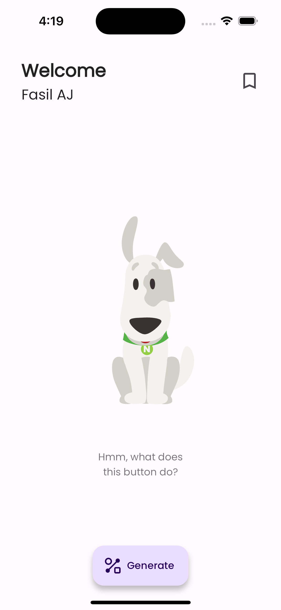
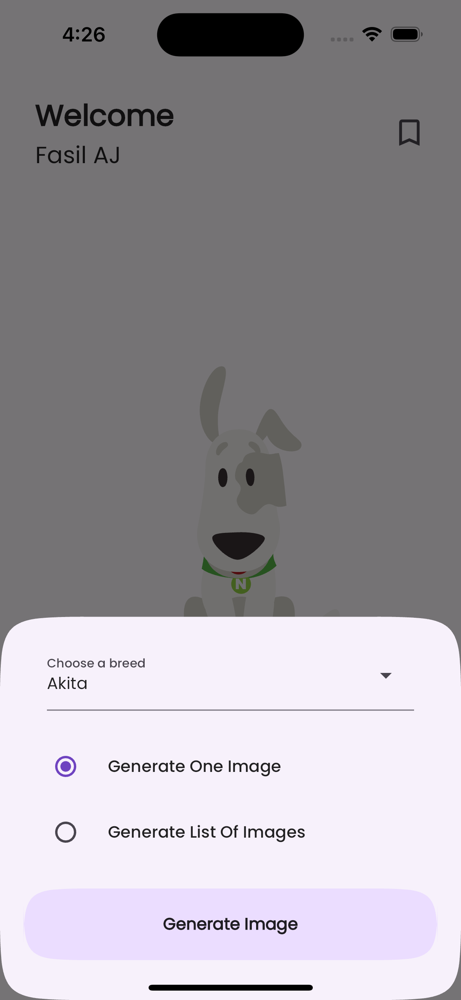
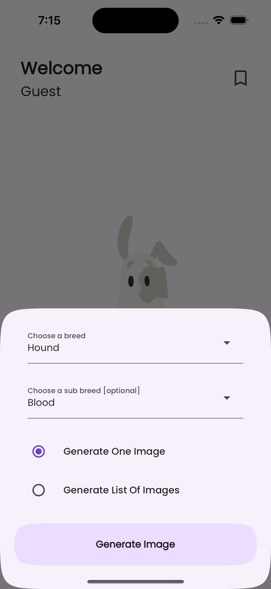
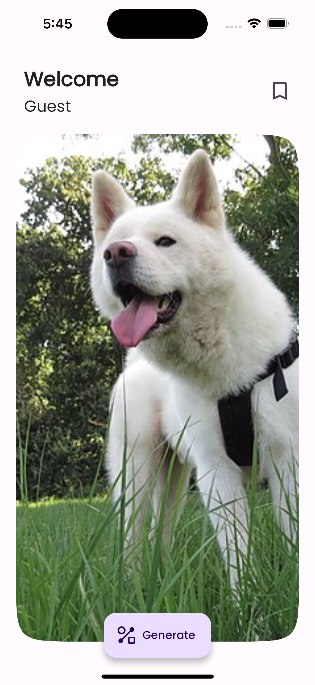
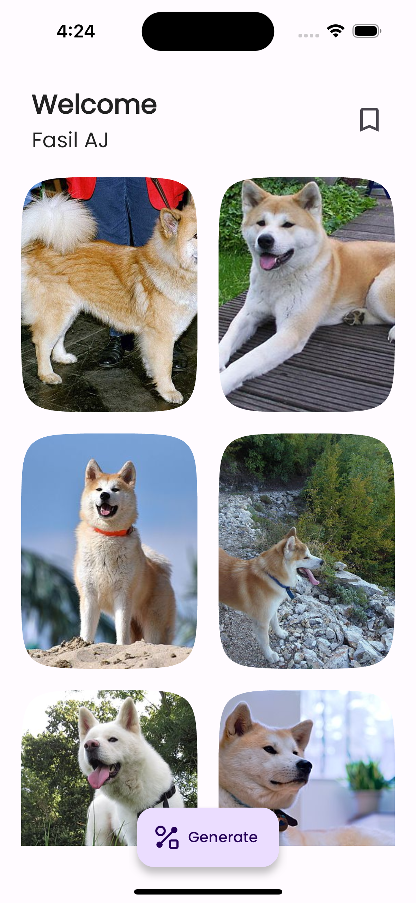

# Deliveristo - Fasil

## Overview
This Flutter application was developed as a coding challenge for a Flutter developer position. It features Google login and an option for anonymous usage. The primary functionality of the app is to display images of dogs based on the following criteria:

- Random image by breed
- List of images by breed
- Random image by breed and sub-breed
- List of images by breed and sub-breed

## Screenshots

Here are some screenshots of the Deliveristo - Fasil application:

1. **Login Screen:**
   

2. **Main View:**
   

3. **Breed Selection:**
   

4. **Sub Breed Selection:**
   

5. **Dog Image Display:**
   

6. **Dog Image List Display:**
   

7. **Saved Images (Future Update):**
   

## Features
- **Google Sign-In:** Users can log in using their Google account.
- **Anonymous Mode:** Allows users to use the app without logging in.
- **Display Random Dog Image by Breed:** Retrieve and display a random dog image by selecting a breed.
- **List Dog Images by Breed:** Display a list of dog images based on the selected breed.
- **Random Dog Image by Breed and Sub-Breed:** Fetch and show a random dog image by selecting a breed and sub-breed.
- **List Dog Images by Breed and Sub-Breed:** Display a list of dog images based on both breed and sub-breed.

## External APIs
- **Dog API:** The app utilizes the [Dog API](https://dog.ceo/dog-api) to fetch dog images based on the specified criteria.

- **Firebase Firestore:** Firebase Firestore is used to store user information and, in future updates, will store users' favorite images for reference.

## Packages Used
- **provider: ^6.0.5**: Used for state management across the application.
- **shared_preferences: ^2.2.2**: Utilized to store user information and eventually, images saved by anonymous users locally.
- **firebase_core: ^2.20.0**: Used to initialize Firebase functionality within the app.
- **firebase_auth: ^4.12.0** and **google_sign_in: ^6.1.5**: Used for user authentication through their Google accounts.
- **cloud_firestore: ^4.12.0**: Used to store saved images and user login history in the cloud.
- **dio: ^5.3.3**: Employed for making API requests.
- **lottie: ^2.6.0**: Used to load engaging animations to guide and inform users about the application's features.
- **google_fonts: ^4.0.4**: Employed to set a free font for the application.
- **dartz: ^0.10.1**: Utilized for handling the results of functions, distinguishing between correct values (right) and errors (left).
- **dropdown_search: ^5.0.6**: Helps users find their desired dog breeds from the list of available breeds.

## Development Dependencies
- **flutter_launcher_icons: ^0.13.1**: Used to set the launcher icon for the app.
- **rename: ^3.0.1**: Employed to set the name of the application.

## How to Run
To run this application on your machine, follow these steps:

1. **Prerequisites:** Ensure that you have Flutter and Dart installed on your system.

2. **Clone the Repository:** Clone this repository to your local machine:

   ```shell
   git clone https://github.com/fasilajibriel/deliveristo_flutter_frontend_coding_challenge.git

2. **Navigate to the Project Directory:** Change your working directory to the project folder:

   ```shell
   cd deliveristo_flutter_frontend_coding_challenge

3. **Install Dependencies:** Run the following command to install the required dependencies:

   ```shell
   flutter pub get

4. **Run the App:** Start the app by executing the following command:

   ```shell
   flutter run --verbose

## License
This project is licensed under the [MIT License](LICENSE).

## Questions?
If you have any questions or need further assistance, please don't hesitate to ask.
